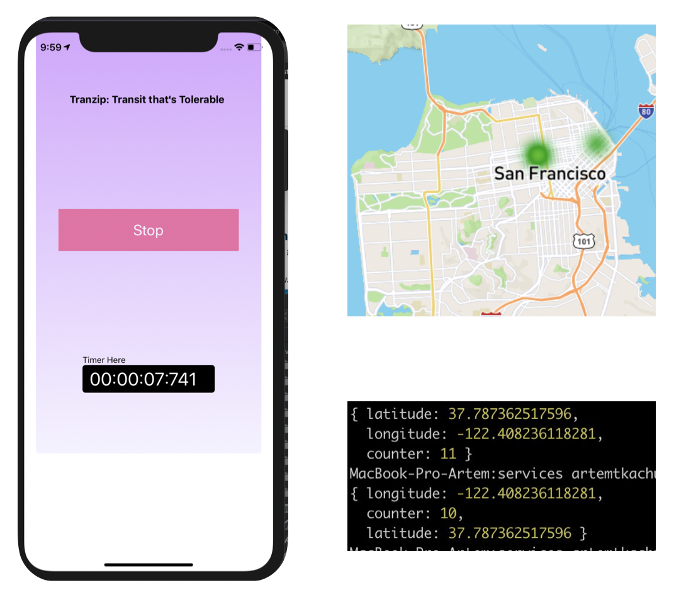

# TranZip - Minerva Hackathon 2019 Project
## United Nations SDG Goal 11: Sustainable Cities and Optimized Transportation

## Inspiration

We live in the Bay Area and take public transportation. That is why we want to make this experience better. We thought we can use Artificial Intelligence power to adjust the routes of buses.

## Structure
  -- Google Cloud App Engine-------  
  ------ Firebase -----------------  
  ------ Node.js server------------  
  ------ Express app --------------  
  -- iOS React-Native application -     
  -- Real-time updating map -------  
  -- Website (project info) -------  
  ---Java Application -------------

## Project submission page

https://devpost.com/software/stickee-k9xb6v

## Project website

https://artem-tkachuk.github.io/MinervaHacks/

## How we built it

We used React Native for building the iOS app and the Firebase and broadcasted the data to MapBox API.

## Challenges we ran into

1. Running java from bash file
2. Working with real-time databases
3. we learned how to use together with the code on different programming languages
4. we learned how to solve configuration problems
5. we learned how to solve merge awful commit problems
6. we learned how to interact with map API and especially mapBox
7. what is serialization
8. We learned how to use real-time databases for displaying the counter values

## Accomplishments that we're proud of

1. We learned how to work as a team

## The Problem:

Today’s bus routes are fixed; each bus follows a set routine path every day which leads to inefficiency if some stations are used more often than others. Congested public transport in urban areas limit bus potential and lead to longer waiting times and inconvenient journeys.

## Why is this important?

Efficient public transportation reduces the amount of cars on the road which in turn maximizes utilization of buses, subways, etc. According to Forbes, the top four reasons commuters are less likely to take advantage of public transportation are the following: “1. Delayed on board due to transit vehicles backed up or problems on the transit route downstream. 2. Experienced long wait at a transfer stop. 3. Missed departure due to wrong real-time information. 4. Unable to board or denied boarding due to crowding.” The typical experience with public transportation has a negative reputation, especially with buses, and this stigma around bus transportation, coupled with the inefficiency of current routing policies, renders public transportation useless.

## Our (Solution) Product

TranZip would be able to identify which stations are “queue hotposts” at using an app for people to notify their queue status. With their input, the algorithm will would continuously recalculate the bus route for each destination to optimize utilization of transportation resources in huge cities. The efficiency of this new perception of public bus systems will increase overall smart city efficiency and reduce car/bus emissions by encouraging people to ride buses with a timely and adaptive schedule instead of taking their own cars.

## DEMO:

The prototype is a working simulation based off of a couple of given conditions and a sample city bus route system with 10 destinations over a period of 24 hours. TranZip 1.0 can successfully reduce the percent of overflow/hotspot occurrences by approximately 70-80% in any given random generator simulation. The second portion is a TranZip app for users to communicate their waiting status through a button system. A large influx of users at bus stations will correlate with a large influx of hotspots on the map display.

## General public incentive:

The best part of this project is that TranZip benefits all communities. People would be able to travel for cheaper -- according the American Public Transportation Association's (APTA) June Transit Savings Report, the average household would save $10,000 yearly by owning one less car and taking public transit instead. With this increased efficiency due to the implementation of TranZip along with the irresistible opportunity to save money, people would more likely turn to this new sustainable transportation system as a way to commute with a lower chance of tardiness.

## City incentive:

This would encourage more citizens to use public transport instead of user-centric selfish algorithms that focus on individual optimization rather than the overall bus system.
Future Aspirations for TranZip

## Future of the project

TransZip holds potential to ultimately change the infrastructure of city public transportation systems and reduce city pollution production. Thus, this would raise living conditions through better air quality and a cleaner environment. Implementing more complex machine learning to dynamically evolve along with the changing dataset files originating from the app Using machine learning to predict possible “queue hotspots” Connect the backend code to a map display through web development, servers, and map api Create higher accuracy for larger and more realistic data (shifting from random generators and simulation to real time input) This application will also target specific times of the day where human pattern shows huge “spikes” for those in need of transportation (morning and evening rush hour for jobs).
